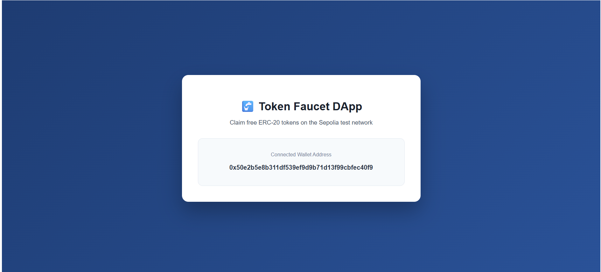
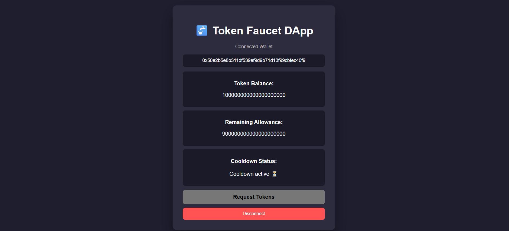
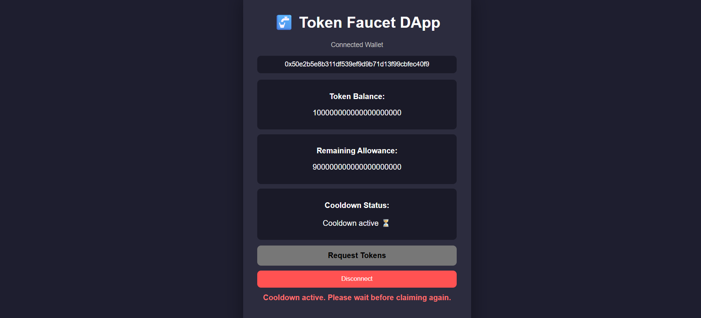
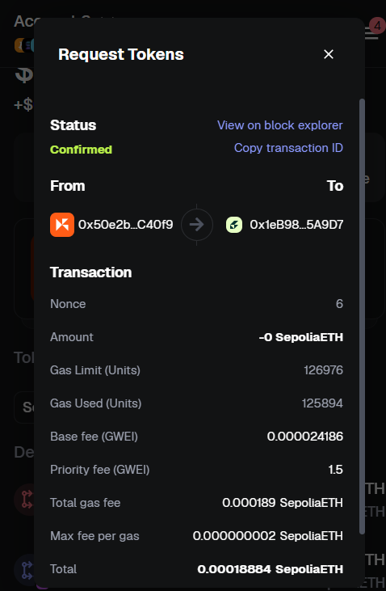
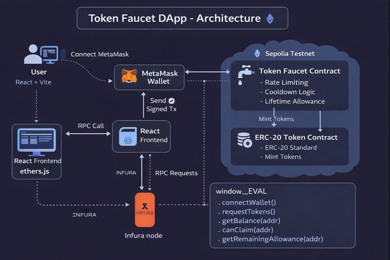

# 🚰 Token Faucet DApp (Sepolia)

A full-stack Ethereum Token Faucet DApp allowing users to claim ERC-20 tokens on Sepolia with cooldown, lifetime limits, and evaluation helpers.

## ✨ Features

**Smart Contracts**
- ERC-20 Token with secure minting
- 24-hour cooldown per wallet
- Lifetime claim limits (1000 ether max)
- Admin pause/unpause control
- Clear revert messages

**Frontend**
- MetaMask wallet connection
- Token claim interface
- Real-time balance display
- Evaluation API via `window.__EVAL__`
- Health check endpoint (`/health`)

## 🛠️ Tech Stack

- **Contracts**: Solidity 0.8.20, Hardhat, OpenZeppelin ERC-20
- **Frontend**: React, Vite, ethers.js v6
- **DevOps**: Docker, Docker Compose

## 📍 Deployed Addresses (Sepolia)

| Contract | Address |
|----------|---------|
| Token | `0x990Fe96fb27a8DCDc0D2fb69b832960F1613BFb0` |
| Faucet | `0x1eB989bEFD7cE47313D8315f17792f9985b5A9D7` |


## ⚙️ Setup

**Environment Variables** (`frontend/.env`)
```env
VITE_RPC_URL=https://sepolia.infura.io/v3/YOUR_INFURA_KEY
VITE_TOKEN_ADDRESS=0x990Fe96fb27a8DCDc0D2fb69b832960F1613BFb0
VITE_FAUCET_ADDRESS=0x1eB989bEFD7cE47313D8315f17792f9985b5A9D7
```

**Local Development**
```bash
cd frontend && npm install && npm run dev
```

**Docker**
```bash
docker-compose up --build
```

Open http://localhost:5173

## 🧪 Evaluation API

Access global evaluation interface via `window.__EVAL__`:

```javascript
await window.__EVAL__.connectWallet()
await window.__EVAL__.requestTokens()
await window.__EVAL__.getBalance(address)
await window.__EVAL__.canClaim(address)
await window.__EVAL__.getRemainingAllowance(address)
await window.__EVAL__.getContractAddresses()
```

## 🩺 Health Check

```
GET /health → OK
```

## 📋 Limits

- **Cooldown**: 24 hours between claims
- **Lifetime Limit**: 1000 ether per wallet
- **Per Claim**: 100 ether

## 📸 Screenshots

- **Wallet Connected**: 
- **Token Balance Display**: 
- **Cooldown Active State**: 
- **Successful Token Request**: 
- **Error Message Display**: 

## 🏗️ Architecture Diagram



## 📜 License

MIT
